# PMS Software - Visual Flowcharts & Diagrams
## Interactive User Flow Diagrams

> **Note**: These diagrams use Mermaid syntax and will render as interactive flowcharts in GitHub, GitLab, VS Code (with Mermaid extension), and many documentation tools.

---

## 📊 Table of Contents
1. [System Authentication Flow](#system-authentication-flow)
2. [Admin Complete Flow](#admin-complete-flow)
3. [Front Desk User Flow](#front-desk-user-flow)
4. [Housekeeping User Flow](#housekeeping-user-flow)
5. [Reservation Management Flow](#reservation-management-flow)
6. [Billing & Payment Flow](#billing--payment-flow)
7. [Magic Link Flow](#magic-link-flow)
8. [Housekeeping Operations Flow](#housekeeping-operations-flow)
9. [Guest Check-in Journey](#guest-check-in-journey)
10. [Guest Check-out Journey](#guest-check-out-journey)

---

## 1. System Authentication Flow

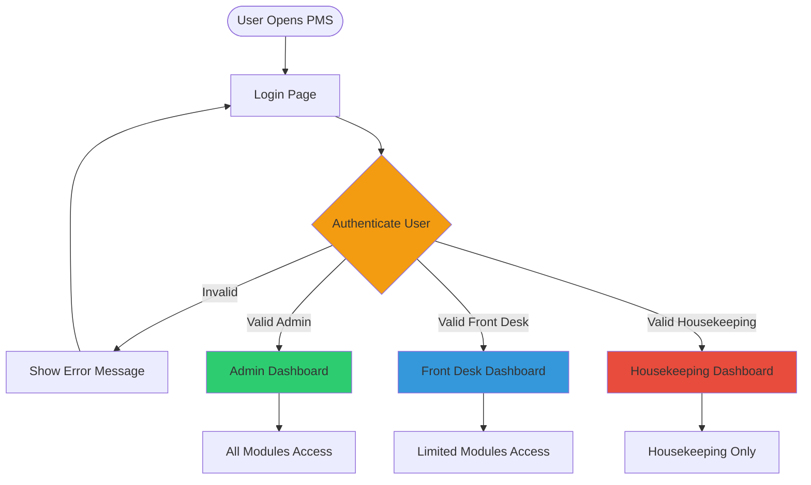

---

## 2. Admin Complete Flow

```mermaid
graph TB
    Admin([Admin User]) --> Dashboard[Admin Dashboard]
    
    Dashboard --> Reservation[Reservation Management]
    Dashboard --> Billing[Billing & Payments]
    Dashboard --> Housekeeping[Housekeeping]
    Dashboard --> MagicLink[Magic Link]
    Dashboard --> CRM[CRM & Chat]
    Dashboard --> Reports[Reports & Analytics]
    Dashboard --> Settings[Settings & Config]
    Dashboard --> Users[User Management]
    
    Reservation --> R1[View Calendar]
    Reservation --> R2[Create Booking]
    Reservation --> R3[Modify Booking]
    Reservation --> R4[Cancel Booking]
    
    Billing --> B1[View Folio]
    Billing --> B2[Process Payment]
    Billing --> B3[Generate Receipt]
    Billing --> B4[Apply Discounts]
    
    Housekeeping --> H1[View Room Status]
    Housekeeping --> H2[Assign Staff]
    Housekeeping --> H3[Update Status]
    Housekeeping --> H4[Export Reports]
    
    MagicLink --> M1[Generate Link]
    MagicLink --> M2[Send to Guest]
    MagicLink --> M3[Track Activity]
    
    CRM --> C1[View Messages]
    CRM --> C2[Reply to Guests]
    CRM --> C3[Booking.com Integration]
    CRM --> C4[Airbnb Integration]
    
    Settings --> S1[Property Settings]
    Settings --> S2[Rate Plans]
    Settings --> S3[Room Types]
    Settings --> S4[Tax Configuration]
    
    Users --> U1[Add Users]
    Users --> U2[Manage Roles]
    Users --> U3[Set Permissions]
    
    style Admin fill:#2ecc71
    style Dashboard fill:#3498db
    style Reservation fill:#e67e22
    style Billing fill:#9b59b6
    style Housekeeping fill:#e74c3c
    style MagicLink fill:#1abc9c
    style CRM fill:#34495e
    style Settings fill:#95a5a6
    style Users fill:#16a085
```

---

## 3. Front Desk User Flow

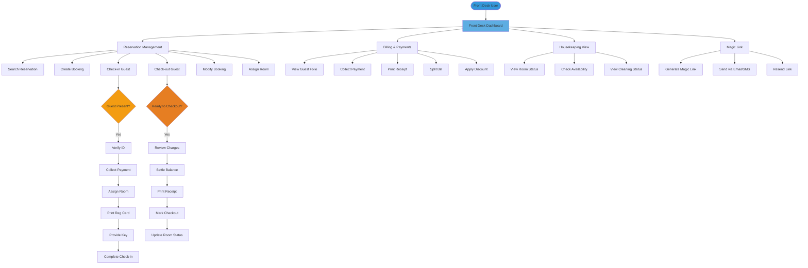

---

## 4. Housekeeping User Flow

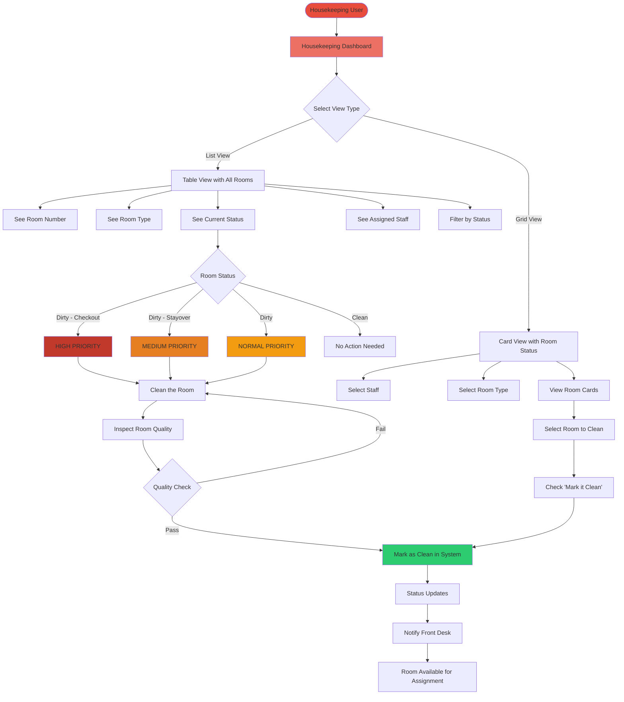

---

## 5. Reservation Management Flow

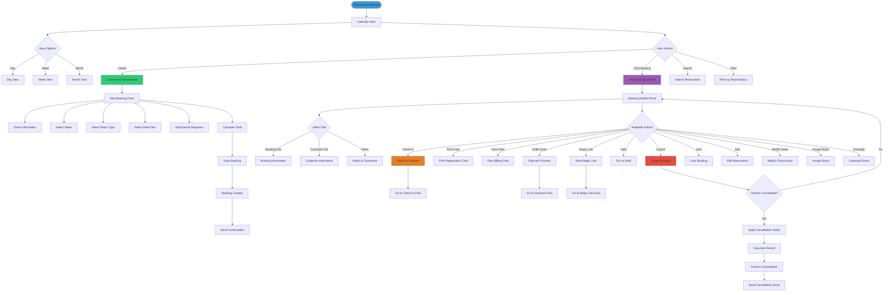

---

## 6. Billing & Payment Flow

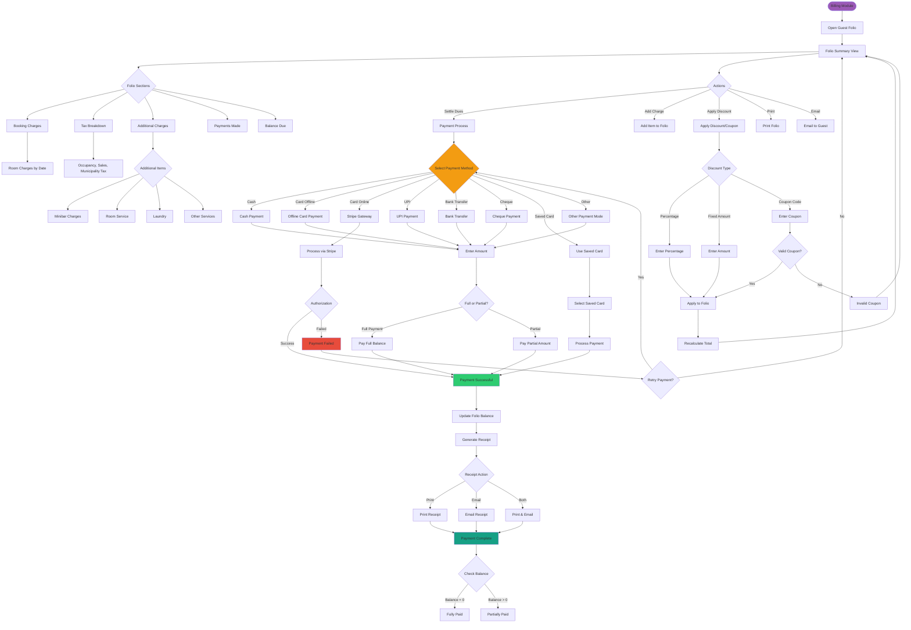

---

## 7. Magic Link Flow

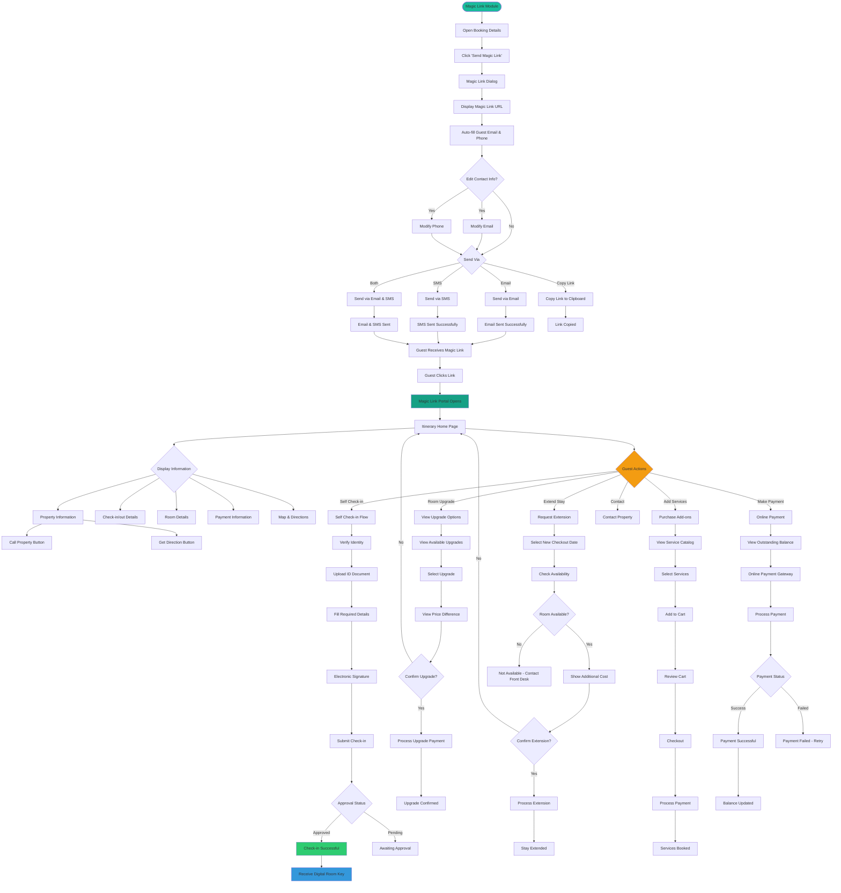

---

## 8. Housekeeping Operations Flow

```mermaid
graph TB
    HKStart([Housekeeping Operations]) --> HKLogin[Housekeeping Staff Login]
    
    HKLogin --> HKDashboard[Housekeeping Dashboard]
    HKDashboard --> StatusOverview[Room Status Overview]
    
    StatusOverview --> Stats{Status Statistics}
    Stats --> Clean[Clean: 0]
    Stats --> CleanOccupied[Clean Occupied: 0]
    Stats --> Dirty[Dirty: 2]
    Stats --> DirtyStayover[Dirty Stayover: 13]
    Stats --> DirtyCheckout[Dirty Checkout: 55]
    Stats --> OutOfOrder[Out of Order: 0]
    Stats --> TotalClean[Total Clean: 0]
    Stats --> TotalDirty[Total Dirty: 70]
    Stats --> AllRooms[All Rooms: 70]
    
    HKDashboard --> ViewToggle{Select View}
    ViewToggle -->|List View| ListView[List View - Table Format]
    ViewToggle -->|Grid View| GridView[Grid View - Card Format]
    
    ListView --> ListFeatures{List View Features}
    ListFeatures --> Search[Search Rooms]
    ListFeatures --> FilterStatus[Filter by Status]
    ListFeatures --> FilterRoom[Filter by Room Type]
    ListFeatures --> FilterStaff[Filter by Staff]
    ListFeatures --> Pagination[Pagination Controls]
    ListFeatures --> Export[Export Report]
    
    ListView --> RoomList[Display Room List]
    RoomList --> RoomColumns{Column Information}
    RoomColumns --> Col1[Room ID]
    RoomColumns --> Col2[Room Type]
    RoomColumns --> Col3[Status]
    RoomColumns --> Col4[Staff Name]
    RoomColumns --> Col5[Staff Email]
    RoomColumns --> Col6[Staff Remark]
    RoomColumns --> Col7[Supervisor]
    
    RoomList --> SelectFromList[Select Room from List]
    SelectFromList --> ViewRoomDetail[View Room Details]
    
    GridView --> GridFeatures{Grid View Features}
    GridFeatures --> SelectStaff[Select Staff Dropdown]
    GridFeatures --> SelectRoomType[Select Room Type]
    GridFeatures --> GridInfo[Info: Admin Only Access]
    
    GridView --> RoomCards[Display Room Cards]
    RoomCards --> CardInfo{Card Information}
    CardInfo --> RoomNumber[Room Number]
    CardInfo --> StatusIndicator[Status Indicator - Red/Green]
    CardInfo --> CheckBox[Mark it Clean Checkbox]
    
    StatusIndicator --> RedDot[🔴 Red = Dirty]
    StatusIndicator --> GreenDot[🟢 Green = Clean]
    
    RoomCards --> SelectFromGrid[Select Room Card]
    
    SelectFromList --> StartCleaning[Start Cleaning Process]
    SelectFromGrid --> StartCleaning
    
    StartCleaning --> AssignToSelf{Assigned to Me?}
    AssignToSelf -->|No| RequestAssign[Request Assignment]
    AssignToSelf -->|Yes| BeginClean[Begin Cleaning]
    
    RequestAssign --> AdminApprove{Admin Approval}
    AdminApprove -->|Approved| BeginClean
    AdminApprove -->|Denied| HKDashboard
    
    BeginClean --> CleaningTasks{Cleaning Tasks}
    CleaningTasks --> Task1[Change Bed Linens]
    CleaningTasks --> Task2[Clean Bathroom]
    CleaningTasks --> Task3[Vacuum/Mop Floor]
    CleaningTasks --> Task4[Dust Surfaces]
    CleaningTasks --> Task5[Restock Amenities]
    CleaningTasks --> Task6[Empty Trash]
    CleaningTasks --> Task7[Check Minibar]
    CleaningTasks --> Task8[Arrange Furniture]
    
    Task1 --> TaskComplete1[Complete]
    Task2 --> TaskComplete2[Complete]
    Task3 --> TaskComplete3[Complete]
    Task4 --> TaskComplete4[Complete]
    Task5 --> TaskComplete5[Complete]
    Task6 --> TaskComplete6[Complete]
    Task7 --> TaskComplete7[Complete]
    Task8 --> TaskComplete8[Complete]
    
    TaskComplete1 --> AllTasksDone{All Tasks Complete?}
    TaskComplete2 --> AllTasksDone
    TaskComplete3 --> AllTasksDone
    TaskComplete4 --> AllTasksDone
    TaskComplete5 --> AllTasksDone
    TaskComplete6 --> AllTasksDone
    TaskComplete7 --> AllTasksDone
    TaskComplete8 --> AllTasksDone
    
    AllTasksDone -->|Yes| QualityCheck[Quality Check]
    AllTasksDone -->|No| CleaningTasks
    
    QualityCheck --> Inspection{Inspection Result}
    Inspection -->|Pass| MarkCleanSystem[Mark as Clean in System]
    Inspection -->|Fail| IssueFound{Issue Type}
    
    IssueFound -->|Minor| FixIssue[Fix Issue]
    IssueFound -->|Major| ReportIssue[Report to Supervisor]
    
    FixIssue --> QualityCheck
    ReportIssue --> SupervisorCheck{Supervisor Decision}
    SupervisorCheck -->|Re-clean| BeginClean
    SupervisorCheck -->|Mark Out of Order| MarkOOO[Mark as Out of Order]
    SupervisorCheck -->|Fix & Continue| FixIssue
    
    MarkCleanSystem --> SystemUpdate[System Updates Status]
    SystemUpdate --> NotifyFrontDesk[Notify Front Desk]
    NotifyFrontDesk --> RoomAvailable[Room Available for Assignment]
    
    RoomAvailable --> Stats2{Update Statistics}
    Stats2 --> DecreaseDirty[Dirty Count -1]
    Stats2 --> IncreaseClean[Clean Count +1]
    
    DecreaseDirty --> RefreshDashboard[Refresh Dashboard]
    IncreaseClean --> RefreshDashboard
    
    RefreshDashboard --> NextRoom{More Rooms to Clean?}
    NextRoom -->|Yes| HKDashboard
    NextRoom -->|No| ShiftComplete[Shift Complete]
    
    ShiftComplete --> GenerateReport[Generate Shift Report]
    GenerateReport --> SubmitReport[Submit to Supervisor]
    SubmitReport --> Logout[Logout]
    
    style HKStart fill:#e74c3c
    style BeginClean fill:#f39c12
    style MarkCleanSystem fill:#2ecc71
    style RoomAvailable fill:#3498db
    style ShiftComplete fill:#16a085
```

---

## 9. Guest Check-in Journey

```mermaid
graph TB
    CheckInStart([Guest Arrives]) --> Reception[Approach Front Desk]
    
    Reception --> FDGreet[Front Desk Greets Guest]
    FDGreet --> AskBooking[Ask for Booking Information]
    
    AskBooking --> GuestProvides{Guest Provides}
    GuestProvides -->|Name| SearchName[Search by Name]
    GuestProvides -->|Booking ID| SearchID[Search by Booking ID]
    GuestProvides -->|Phone| SearchPhone[Search by Phone]
    GuestProvides -->|Email| SearchEmail[Search by Email]
    
    SearchName --> FindBooking{Booking Found?}
    SearchID --> FindBooking
    SearchPhone --> FindBooking
    SearchEmail --> FindBooking
    
    FindBooking -->|No| NoBooking[No Booking Found]
    FindBooking -->|Yes| OpenBooking[Open Booking Details]
    
    NoBooking --> CreateWalkIn{Create Walk-in?}
    CreateWalkIn -->|Yes| CreateBooking[Create New Booking]
    CreateWalkIn -->|No| ApologizeGuest[Apologize - Cannot Check-in]
    
    CreateBooking --> NewBookingProcess[New Booking Process]
    NewBookingProcess --> OpenBooking
    
    OpenBooking --> VerifyDetails[Verify Booking Details]
    VerifyDetails --> CheckDetails{Verify Information}
    CheckDetails --> GuestName[Guest Name]
    CheckDetails --> RoomType[Room Type]
    CheckDetails --> CheckInDate[Check-in Date]
    CheckDetails --> CheckOutDate[Check-out Date]
    CheckDetails --> NumGuests[Number of Guests]
    CheckDetails --> SpecialRequests[Special Requests]
    
    VerifyDetails --> DetailsCorrect{Details Correct?}
    DetailsCorrect -->|No| ModifyDetails[Modify Booking Details]
    DetailsCorrect -->|Yes| RequestID[Request Guest ID]
    
    ModifyDetails --> SaveChanges[Save Changes]
    SaveChanges --> RequestID
    
    RequestID --> VerifyID[Verify Guest Identity]
    VerifyID --> IDTypes{ID Document Type}
    IDTypes --> Passport[Passport]
    IDTypes --> DrivingLicense[Driving License]
    IDTypes --> NationalID[National ID]
    IDTypes --> Other[Other Government ID]
    
    Passport --> ScanID[Scan/Copy ID Document]
    DrivingLicense --> ScanID
    NationalID --> ScanID
    Other --> ScanID
    
    ScanID --> AttachToBooking[Attach to Booking]
    AttachToBooking --> RoomAssignment{Room Assigned?}
    
    RoomAssignment -->|No| CheckAvail[Check Room Availability]
    RoomAssignment -->|Yes| RoomReady
    
    CheckAvail --> AvailRooms{Available Rooms?}
    AvailRooms -->|No| NoRooms[No Rooms Available]
    AvailRooms -->|Yes| SelectRoom[Select Room]
    
    NoRooms --> OfferAlternative{Offer Alternative?}
    OfferAlternative -->|Upgrade| OfferUpgrade[Offer Upgrade]
    OfferAlternative -->|Wait| WaitForRoom[Wait for Room]
    OfferAlternative -->|Cancel| CancelCheckin[Cancel Check-in]
    
    OfferUpgrade --> GuestAccepts{Guest Accepts?}
    GuestAccepts -->|Yes| AdjustPrice[Adjust Price]
    GuestAccepts -->|No| WaitForRoom
    
    AdjustPrice --> SelectRoom
    SelectRoom --> AssignRoom[Assign Room to Booking]
    AssignRoom --> RoomReady{Room Ready?}
    
    RoomReady -->|Not Clean| WaitCleaning[Wait for Housekeeping]
    RoomReady -->|Clean| ProceedPayment[Proceed to Payment]
    
    WaitCleaning --> CheckStatus{Check Room Status}
    CheckStatus -->|Still Dirty| ContactHK[Contact Housekeeping]
    CheckStatus -->|Now Clean| ProceedPayment
    
    ContactHK --> UrgentClean[Request Urgent Cleaning]
    UrgentClean --> WaitCleaning
    
    ProceedPayment --> ReviewCharges[Review Charges with Guest]
    ReviewCharges --> ShowFolio[Show Folio Summary]
    ShowFolio --> FolioBreakdown{Folio Items}
    FolioBreakdown --> RoomCharges[Room Charges]
    FolioBreakdown --> TaxCharges[Tax Breakdown]
    FolioBreakdown --> TotalAmount[Total Amount]
    
    ShowFolio --> PaymentPolicy{Payment Policy}
    PaymentPolicy -->|Full Payment| RequireFullPay[Require Full Payment]
    PaymentPolicy -->|Deposit| RequireDeposit[Require Deposit]
    PaymentPolicy -->|Pay at Checkout| NoPaymentNow[No Payment Required Now]
    
    RequireFullPay --> CollectPayment[Collect Payment]
    RequireDeposit --> CollectPayment
    NoPaymentNow --> CaptureCard[Capture Card Details]
    
    CollectPayment --> PaymentMethodCI{Payment Method}
    PaymentMethodCI --> ProcessPaymentCI[Process Payment]
    ProcessPaymentCI --> PaymentSuccessCI{Payment Success?}
    PaymentSuccessCI -->|Yes| PaymentComplete[Payment Recorded]
    PaymentSuccessCI -->|No| PaymentFailed[Payment Failed]
    PaymentFailed --> RetryPayment{Retry?}
    RetryPayment -->|Yes| CollectPayment
    RetryPayment -->|No| CancelCheckin
    
    CaptureCard --> SaveCardInfo[Save Card Information]
    SaveCardInfo --> PaymentComplete
    PaymentComplete --> PrintRegCard[Print Registration Card]
    
    PrintRegCard --> GuestSign[Guest Signs Reg Card]
    GuestSign --> ScanSignature[Scan Signed Document]
    ScanSignature --> AttachSignature[Attach to Booking]
    
    AttachSignature --> AdditionalServices{Offer Additional Services?}
    AdditionalServices -->|Breakfast| OfferBreakfast[Offer Breakfast Package]
    AdditionalServices -->|Parking| OfferParking[Offer Parking]
    AdditionalServices -->|Spa| OfferSpa[Offer Spa Services]
    AdditionalServices -->|None| PrepareKey
    
    OfferBreakfast --> GuestInterested{Guest Interested?}
    OfferParking --> GuestInterested
    OfferSpa --> GuestInterested
    GuestInterested -->|Yes| AddService[Add to Folio]
    GuestInterested -->|No| PrepareKey
    AddService --> PrepareKey[Prepare Room Key]
    
    PrepareKey --> KeyType{Key Type}
    KeyType -->|Card Key| ProgramCardKey[Program Card Key]
    KeyType -->|Digital Key| SendDigitalKey[Send Digital Key to App]
    KeyType -->|Physical Key| ProvidePhysicalKey[Provide Physical Key]
    
    ProgramCardKey --> KeyReady[Key Ready]
    SendDigitalKey --> KeyReady
    ProvidePhysicalKey --> KeyReady
    
    KeyReady --> PropertyOrientation[Provide Property Information]
    PropertyOrientation --> Inform{Inform Guest About}
    Inform --> WiFiInfo[WiFi Password]
    Inform --> BreakfastTime[Breakfast Timings]
    Inform --> CheckoutTime[Checkout Time]
    Inform --> Amenities[Property Amenities]
    Inform --> EmergencyInfo[Emergency Procedures]
    
    PropertyOrientation --> OfferAssistance[Offer Luggage Assistance]
    OfferAssistance --> AssistanceNeeded{Assistance Needed?}
    AssistanceNeeded -->|Yes| CallPorter[Call Porter]
    AssistanceNeeded -->|No| DirectToRoom
    
    CallPorter --> DirectToRoom[Direct Guest to Room]
    DirectToRoom --> MarkCheckedIn[Mark as Checked In - System]
    
    MarkCheckedIn --> UpdateStatus[Update Booking Status]
    UpdateStatus --> NotifyHK[Notify Housekeeping - Room Occupied]
    NotifyHK --> SendConfirmation[Send Check-in Confirmation Email]
    
    SendConfirmation --> OfferMagicLink{Send Magic Link?}
    OfferMagicLink -->|Yes| SendMagic[Send Magic Link]
    OfferMagicLink -->|No| CheckInComplete
    
    SendMagic --> CheckInComplete[✓ Check-in Complete]
    CheckInComplete --> WishGoodStay[Wish Guest Pleasant Stay]
    
    style CheckInStart fill:#3498db
    style VerifyID fill:#f39c12
    style CollectPayment fill:#9b59b6
    style MarkCheckedIn fill:#2ecc71
    style CheckInComplete fill:#16a085
```

---

## 10. Guest Check-out Journey

```mermaid
graph TB
    CheckOutStart([Guest Ready to Checkout]) --> ApproachDesk[Guest Approaches Front Desk]
    
    ApproachDesk --> FDCheckout[Front Desk Receives Guest]
    FDCheckout --> RequestRoom[Request Room Number]
    
    RequestRoom --> SearchGuest[Search Guest Booking]
    SearchGuest --> FindGuest{Booking Found?}
    FindGuest -->|No| NotFound[Booking Not Found]
    FindGuest -->|Yes| OpenGuestFolio[Open Guest Folio]
    
    NotFound --> AskDetails[Ask for More Details]
    AskDetails --> SearchAgain[Search Again]
    SearchAgain --> FindGuest
    
    OpenGuestFolio --> CurrentStatus{Current Status}
    CurrentStatus -->|Not Checked In| ErrorNotCheckedIn[Error: Not Checked In]
    CurrentStatus -->|Already Checked Out| ErrorAlreadyOut[Error: Already Checked Out]
    CurrentStatus -->|Checked In| ProceedCheckout[Proceed with Checkout]
    
    ProceedCheckout --> InquireStay[Inquire About Stay Quality]
    InquireStay --> GuestFeedback{Guest Feedback}
    GuestFeedback -->|Positive| ThankGuest[Thank Guest]
    GuestFeedback -->|Negative| RecordComplaint[Record Complaint]
    GuestFeedback -->|Neutral| Acknowledge[Acknowledge]
    
    RecordComplaint --> EscalateIssue{Escalate?}
    EscalateIssue -->|Yes| NotifyManager[Notify Manager]
    EscalateIssue -->|No| ProceedWithBill
    NotifyManager --> ManagerResponse{Manager Action}
    ManagerResponse --> ApplyComp[Apply Compensation]
    ManagerResponse --> ProceedWithBill[Proceed with Bill]
    
    ThankGuest --> ProceedWithBill
    Acknowledge --> ProceedWithBill
    ApplyComp --> ProceedWithBill
    
    ProceedWithBill --> RoomInspection[Inquire About Room Condition]
    RoomInspection --> CheckMinibar{Check Minibar}
    CheckMinibar --> MinibarUsed{Items Used?}
    MinibarUsed -->|Yes| AddMinibarCharges[Add Minibar Charges to Folio]
    MinibarUsed -->|No| CheckDamage
    
    AddMinibarCharges --> CheckDamage{Check for Damages}
    CheckDamage -->|Damage Found| AssessDamage[Assess Damage]
    CheckDamage -->|No Damage| ReviewFolio
    
    AssessDamage --> CalculateDamage[Calculate Damage Cost]
    CalculateDamage --> InformGuest[Inform Guest of Charge]
    InformGuest --> GuestAgree{Guest Agrees?}
    GuestAgree -->|Yes| AddDamageCharge[Add Damage Charge to Folio]
    GuestAgree -->|No| DisputeProcess[Initiate Dispute Process]
    
    DisputeProcess --> DocumentEvidence[Document Evidence]
    DocumentEvidence --> ManagerDecision[Manager Decision]
    ManagerDecision --> FinalCharge{Final Decision}
    FinalCharge -->|Charge| AddDamageCharge
    FinalCharge -->|Waive| ReviewFolio
    
    AddDamageCharge --> ReviewFolio[Review Complete Folio]
    ReviewFolio --> DisplayFolio[Display Folio to Guest]
    
    DisplayFolio --> FolioSections{Folio Sections}
    FolioSections --> AccomCharges[Accommodation Charges]
    FolioSections --> TaxBreakdown[Tax Breakdown]
    FolioSections --> AddCharges[Additional Charges]
    FolioSections --> PrevPayments[Previous Payments]
    FolioSections --> CurrentBalance[Current Balance]
    
    DisplayFolio --> GuestReview{Guest Reviews Folio}
    GuestReview -->|Dispute| HandleDispute[Handle Dispute]
    GuestReview -->|Approve| CheckBalance
    
    HandleDispute --> ResolveDispute[Resolve with Guest]
    ResolveDispute --> AdjustFolio[Adjust Folio if Needed]
    AdjustFolio --> CheckBalance{Check Balance}
    
    CheckBalance -->|Balance = 0| AlreadyPaid[Already Fully Paid]
    CheckBalance -->|Balance > 0| ProcessPayment[Process Final Payment]
    CheckBalance -->|Balance < 0| RefundDue[Refund Due to Guest]
    
    AlreadyPaid --> PrepareReceipt[Prepare Receipt]
    
    ProcessPayment --> SelectPaymentMethod{Payment Method}
    SelectPaymentMethod -->|Same as Check-in| UseExistingMethod[Use Existing Payment Method]
    SelectPaymentMethod -->|New Method| NewPaymentMethod[Select New Payment Method]
    
    UseExistingMethod --> ChargeCard[Charge Saved Card]
    NewPaymentMethod --> ProcessNewPayment[Process New Payment]
    
    ChargeCard --> PaymentResult{Payment Result}
    ProcessNewPayment --> PaymentResult
    PaymentResult -->|Success| PaymentCompleted[Payment Completed]
    PaymentResult -->|Failed| PaymentError[Payment Error]
    
    PaymentError --> RetryCheckout{Retry Payment?}
    RetryCheckout -->|Yes| ProcessPayment
    RetryCheckout -->|No| HoldCheckout[Hold Checkout - Unresolved]
    
    PaymentCompleted --> UpdateFolioFinal[Update Final Folio]
    UpdateFolioFinal --> PrepareReceipt
    
    RefundDue --> CalculateRefund[Calculate Refund Amount]
    CalculateRefund --> RefundMethod{Refund Method}
    RefundMethod -->|Original Payment| RefundOriginal[Refund to Original Method]
    RefundMethod -->|Cash| RefundCash[Refund Cash]
    RefundMethod -->|Bank Transfer| RefundBank[Refund via Bank]
    
    RefundOriginal --> ProcessRefund[Process Refund]
    RefundCash --> ProcessRefund
    RefundBank --> ProcessRefund
    ProcessRefund --> RefundComplete[Refund Processed]
    RefundComplete --> PrepareReceipt
    
    PrepareReceipt --> GenerateReceipt[Generate Final Receipt]
    GenerateReceipt --> ReceiptOptions{Receipt Options}
    ReceiptOptions -->|Print| PrintReceiptCO[Print Receipt]
    ReceiptOptions -->|Email| EmailReceiptCO[Email Receipt]
    ReceiptOptions -->|Both| BothReceiptCO[Print & Email]
    
    PrintReceiptCO --> ProvideReceipt[Provide Receipt to Guest]
    EmailReceiptCO --> ProvideReceipt
    BothReceiptCO --> ProvideReceipt
    
    ProvideReceipt --> CollectKey[Collect Room Key]
    CollectKey --> KeyReturned{Key Returned?}
    KeyReturned -->|Yes| KeyReceived[Key Received]
    KeyReturned -->|No| MissingKey[Note Missing Key]
    
    MissingKey --> KeyFee{Charge Key Fee?}
    KeyFee -->|Yes| ChargeKeyFee[Charge Key Replacement Fee]
    KeyFee -->|No| WaiveKeyFee[Waive Fee]
    ChargeKeyFee --> KeyReceived
    WaiveKeyFee --> KeyReceived
    
    KeyReceived --> FeedbackRequest[Request Review/Feedback]
    FeedbackRequest --> OfferServices{Offer Future Services}
    OfferServices --> LoyaltyProgram[Mention Loyalty Program]
    OfferServices --> FutureDiscount[Offer Return Discount]
    OfferServices --> Newsletter[Invite Newsletter Signup]
    
    LoyaltyProgram --> SystemCheckout[Mark as Checked Out - System]
    FutureDiscount --> SystemCheckout
    Newsletter --> SystemCheckout
    
    SystemCheckout --> UpdateBookingStatus[Update Booking Status: Checked Out]
    UpdateBookingStatus --> UpdateRoomStatus[Update Room Status: Dirty - Checkout]
    UpdateRoomStatus --> NotifyHousekeeping[Notify Housekeeping]
    NotifyHousekeeping --> ReleaseRoom[Release Room from Guest]
    
    ReleaseRoom --> SendSurvey{Send Guest Survey?}
    SendSurvey -->|Yes| EmailSurvey[Email Satisfaction Survey]
    SendSurvey -->|No| FarewellGuest
    
    EmailSurvey --> FarewellGuest[Thank Guest & Wish Safe Journey]
    FarewellGuest --> PorterAssist{Luggage Assistance?}
    PorterAssist -->|Yes| CallPorterCO[Call Porter]
    PorterAssist -->|No| CheckOutComplete
    
    CallPorterCO --> CheckOutComplete[✓ Checkout Complete]
    CheckOutComplete --> UpdateStats[Update Dashboard Statistics]
    UpdateStats --> ArchiveBooking[Archive Completed Booking]
    
    style CheckOutStart fill:#e67e22
    style ReviewFolio fill:#9b59b6
    style ProcessPayment fill:#f39c12
    style PaymentCompleted fill:#2ecc71
    style CheckOutComplete fill:#16a085
```

---

## 🎨 Legend & Color Coding

### User Roles
- 🟢 **Green (#2ecc71)** = Admin
- 🔵 **Blue (#3498db)** = Front Desk
- 🔴 **Red (#e74c3c)** = Housekeeping

### Status Colors
- 🟢 **Green** = Completed/Success/Clean
- 🔴 **Red** = Dirty/Failed/Error
- 🟡 **Yellow (#f39c12)** = In Progress/Pending
- 🟣 **Purple (#9b59b6)** = Billing/Payment
- 🔵 **Teal (#1abc9c)** = Magic Link/Guest Portal
- 🟠 **Orange (#e67e22)** = Check-in/Check-out

### Decision Points
- 🔶 **Diamond Shape** = Decision Point (Yes/No)
- 🔷 **Hexagon** = Multiple Choice Selection
- 📦 **Rectangle** = Process/Action
- 🎯 **Rounded Rectangle** = Start/End Point

---

## 📱 Integration Points

### External Systems
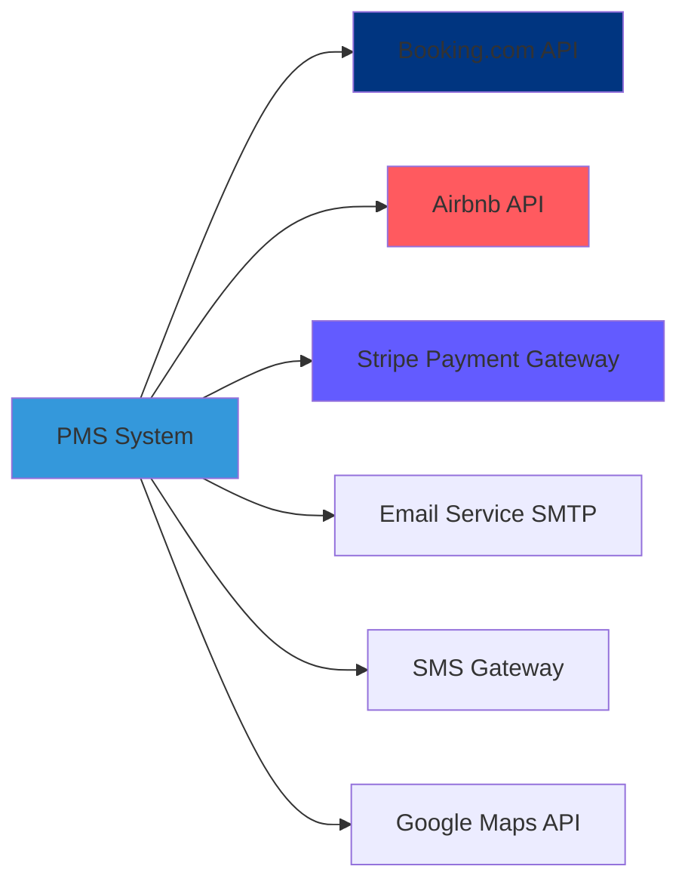

---

## 🔐 Security & Access Control Flow

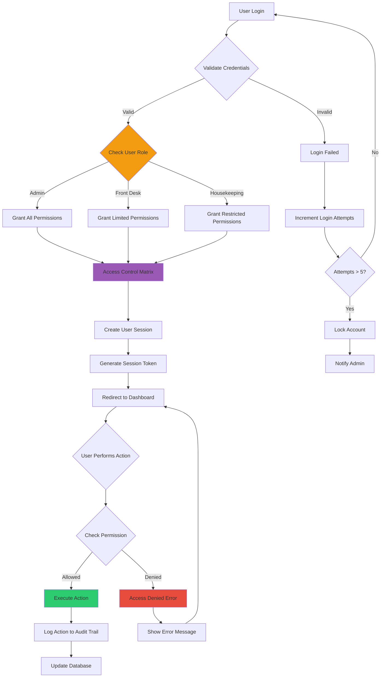

---

## 📊 Data Flow Architecture

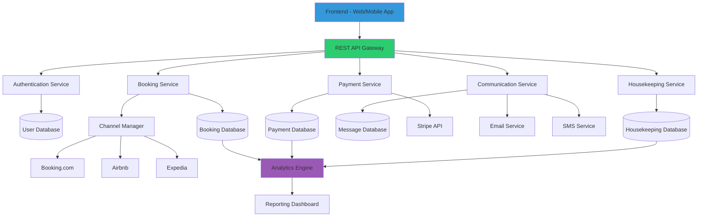

---

## 📈 Success Metrics Dashboard

```mermaid
graph TB
    Metrics[PMS Metrics Dashboard] --> Operational[Operational Metrics]
    Metrics --> Financial[Financial Metrics]
    Metrics --> Guest[Guest Metrics]
    Metrics --> Staff[Staff Metrics]
    
    Operational --> AvgCheckIn[Avg Check-in Time]
    Operational --> RoomTurnover[Room Turnover Time]
    Operational --> Occupancy[Occupancy Rate]
    Operational --> SystemUptime[System Uptime]
    
    Financial --> Revenue[Total Revenue]
    Financial --> ADR[Average Daily Rate]
    Financial --> RevPAR[Revenue per Available Room]
    Financial --> PaymentSuccess[Payment Success Rate]
    
    Guest --> Satisfaction[Guest Satisfaction Score]
    Guest --> Repeat[Repeat Guest Rate]
    Guest --> Reviews[Review Ratings]
    Guest --> Complaints[Complaint Resolution Time]
    
    Staff --> Efficiency[Staff Efficiency]
    Staff --> CleaningTime[Avg Cleaning Time]
    Staff --> ErrorRate[Error Rate]
    Staff --> Productivity[Productivity Score]
    
    style Metrics fill:#3498db
    style Operational fill:#2ecc71
    style Financial fill:#9b59b6
    style Guest fill:#e67e22
    style Staff fill:#1abc9c
```

---